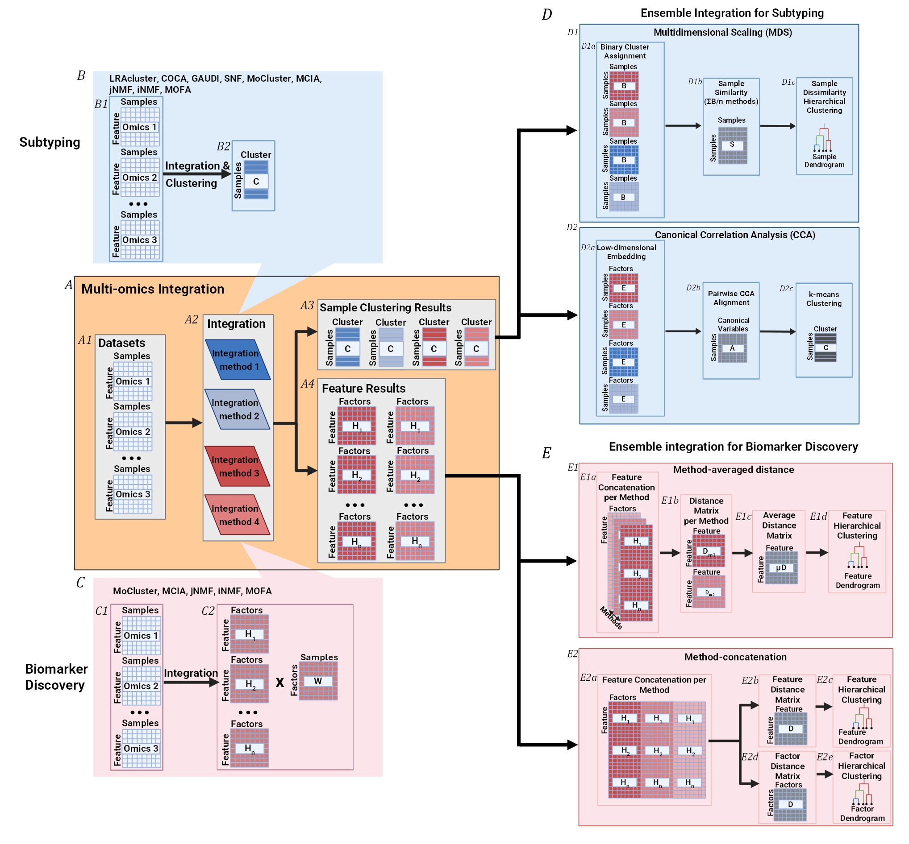
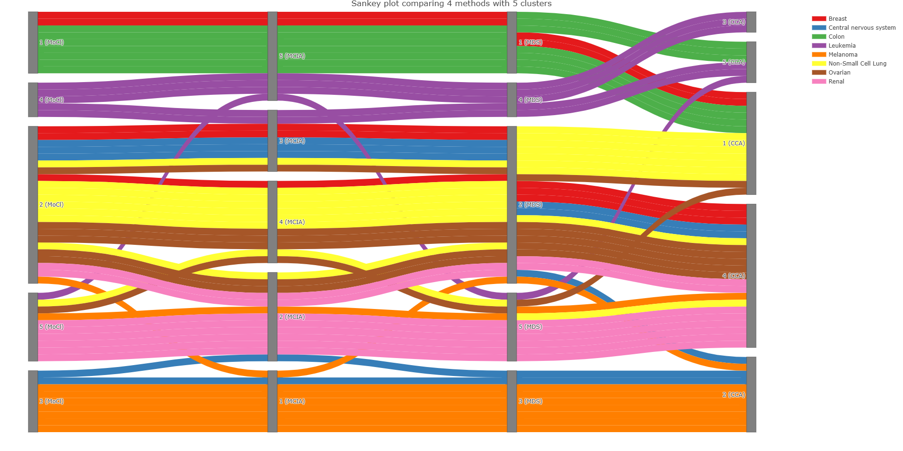

<!-- README.md is generated from README.Rmd. Please edit that file -->

# EINS

<!-- badges: start -->

<!-- badges: end -->

Integrating multi-omics data such as genomics, proteomics, metabolomics,
and lipidomics provides deeper insights into cellular biology and
disease than single-omics analyses. The diversity of available
integration strategies, each based on distinct statistical frameworks,
often produces heterogeneous, difficult-to-compare results. We developed
Ensemble INtegration Suite (EINS), a framework that integrates outputs
from numerous multi-omics integration methods for both subtyping and
biomarker discovery, i.e. at the sample and embedding levels. EINS is a
pipeline implemented as an R6 object that includes three parts;
preprocessing and single-omics analysis, multi-omics integration, and
ensemble integration, as well as various interactive and static
visualization possibilities. Preprocessing steps cover data import,
feature filtering, normalization, missing value imputation, batch effect
correction, and sample matching across omics modalities. Single-omics
analysis allows subtyping using either model-based or hierarchical
approaches. For multi-omics integration, EINS calculates the optimal
cluster number using 30 scores and implements nine methods: MoCluster,
MCIA, jNMF, iNMF, LRAcluster, COCA, MOFA, GAUDI, and SNF. Following
multi-omics integration, both sample and feature results can be
ensembled, i.e. subtyping and biomarker discovery, respectively, to
identify consistent patterns across multi-omics integration methods.

<figure>

<figcaption aria-hidden="true">EINS Overview</figcaption>
</figure>

### Installation

You can install EINS like so:

``` r
devtools::install_github("MaraZuid/Ensemble-Integration-Suite")
```

### How to use

Within this package, a small subset of the NCI60 methylation (400
genes), transcriptomics (500 genes) and proteomics (300 proteins) data,
as well as a metadata file, are available for pipeline exploration
purposes. To start working with EINS, the EINS R6 class object needs to
be initialized.

``` r
library(EINS)
#> 
EINS_NCI60 <- Ensemble_Integration_Suite$new()
```

Then, omics files and sample metadata files can be imported from the R
environment, per omics dataset.

``` r
EINS_NCI60$add_Omics_df(OmicsName = "Proteomics", DataDF = EINS_NCI60_Toy$Proteomics, MetaDF = EINS_NCI60_Toy$Metadata)
EINS_NCI60$add_Omics_df(OmicsName = "Transcriptomics", DataDF = EINS_NCI60_Toy$Transcriptomics, MetaDF = EINS_NCI60_Toy$Metadata)
EINS_NCI60$add_Omics_df(OmicsName = "Methylation", DataDF = EINS_NCI60_Toy$Methylation, MetaDF = EINS_NCI60_Toy$Metadata)
```

Additionally, function `$add_Omics_file()` can import data from file
path. This requires omics data files to contain only sample names,
feature names and measurements, no additional metadata columns.

The imported data is stored in the EINS object, in the `$Omics` list.
The omics dataset is stored in `$Omics$Raw_Data` per omics, and the
metadata is stored in `$Omics$Metadata` per omics.

Following this, the datasets can be preprocessed. For the NCI60 toy
data, z-score normalization was performed on the proteomics and
methylation datasets, and NA imputation was performed on all datasets.

``` r
EINS_NCI60$run_Preprocessing(OmicsName = "Proteomics", FunctionOrder = c("Normalization", "NAImpute"), NAMethod = "knn", NA_K_Neighbors = 10)
EINS_NCI60$run_Preprocessing(OmicsName = "Transcriptomics", FunctionOrder = c("NAImpute"), NAMethod = "knn", NA_K_Neighbors = 10)
EINS_NCI60$run_Preprocessing(OmicsName = "Methylation", FunctionOrder = c("Normalization", "NAImpute"), NAMethod = "knn", NA_K_Neighbors = 10)
```

The preprocessed data is then stored in the `$Omics$Preprocessed_Omics`
list.

Multiple of the multi-omics integration methods included in EINS require
matching samples across dataset, in the same order, so sample matching
is performed.

``` r
EINS_NCI60$run_Sample_Matching()
```

The omics datasets with matching samples are then stored in the
`$Omics$Preprocessed_Omics$Matched_Data` list.

Following this, single-omics sample subtyping can be performed, please
refer to the EINS vignette for details.

Nine multi-omics integration methods are available to perform in EINS.
These methods can be performed using functions: `$run_MoCluster()`,
`$run_MCIA()`, `$run_jNMF()`, `$run_iNMF()`, `$run_LRAcluster()`,
`$run_COCA()`, `$run_MOFA()`, `$run_SNF()`, and `$run_GAUDI()`. The
results for these methods can be found in the `$Multi_Omics` list.

``` r
EINS_NCI60$run_MoCluster(Clusters = 2:8, Components = 5, Linkage = "ward.D2")
EINS_NCI60$run_MCIA(Components = 5, PerformCluster = TRUE, Clusters = 2:8)
```

From the multi-omics integration results, an ensemble can be created for
both sample subtyping and biomarker discovery.

Both Multidimensional Scaling (MDS) and Canonical Correlation Analysis
can be performed to ensemble sample subtypes from multi-omics clustering
results. The ensemble sample results can be found in the
`$Ensemble$Samples` list.

``` r
EINS_NCI60$run_Ensemble_Sample_MDS(Clusters = 5)
EINS_NCI60$run_Ensemble_Sample_CCA(Clusters = 5, Reference = "MoCluster", Factors = 5)
```

Biomarker ensemble integration can also be performed with 2 methods,
Average or Concatenation, although we will only use Average for this
README. More details regarding this can be found in the vignette and
related manuscript. The ensemble feature results can be found in the
`$Ensemble$Features` list.

``` r
EINS_NCI60$run_Ensemble_Integration_Feature(Method = "Average", nFactors = 5)
```

For information regarding further investigation of the biomarker
ensemble, including overrepresentation analysis of the ensemble feature
results, please refer to the vignette.

Multiple visualization options are available in EINS. We will highlight
2 examples. All plots are stored in the `$Plots` list. For information
regarding the additional visualizations, please refer to the vignette.

A non-interactive multi-omics heatmap can be created, with sample
cluster assignment for the different methods and metadata annotation on
the X-axis.

``` r
EINS_NCI60$plot_Multi_Omics_Heatmap(MetadataFeatures = c("tissue of origin", "Epithelial", "sex", "p53"))
EINS_NCI60$Plots$Multi_Omics_Heatmap$Ensemble$MDS$Clusters_5
```


A Sankey plot with the cluster assignments for multiple multi-omics
integration methods and subtype ensemble results with the same number of
clusters can be created.

``` r
EINS_NCI60$plot_Sankey_Methods(MetadataFeature = "tissue of origin", Ensemble = TRUE, SNFDistance = "euclidean squared")
EINS_NCI60$Plots$Sankey_Methods$Selected$Clusters_5
```

<figure>

<figcaption aria-hidden="true">PNG of Sankey HTML widget</figcaption>
</figure>


